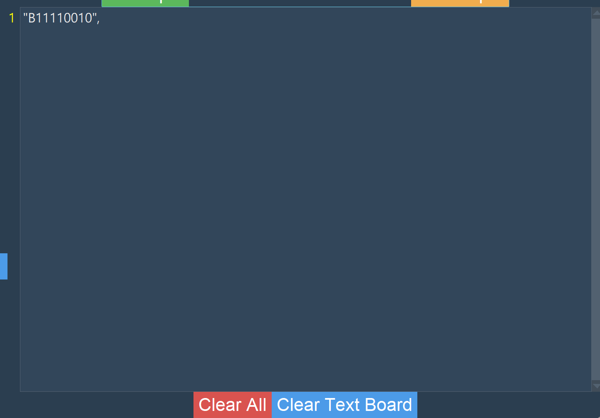
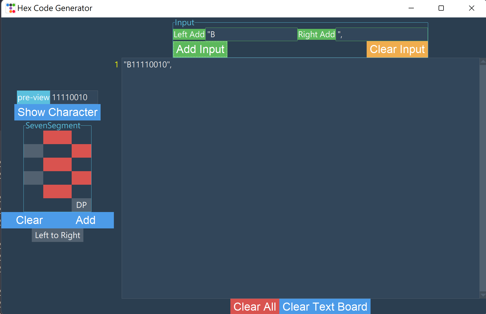

# HEXCodeGenerator
### Written by KYLiN 

---

This is a code for make seven segment code to be a binary code.

---

## Download

### Zip 
you can click Code to download zip 

### Git 
you can use this command `git clone https://github.com/KeithLin724/HexCodeGenerator`

---
# How to Use 
> This is the display of GUI

> You use SevenSegment to Simulate the picture what you want , click to add to total display 

> also you can add some output format 

> This is the output Board 

> This is a example

